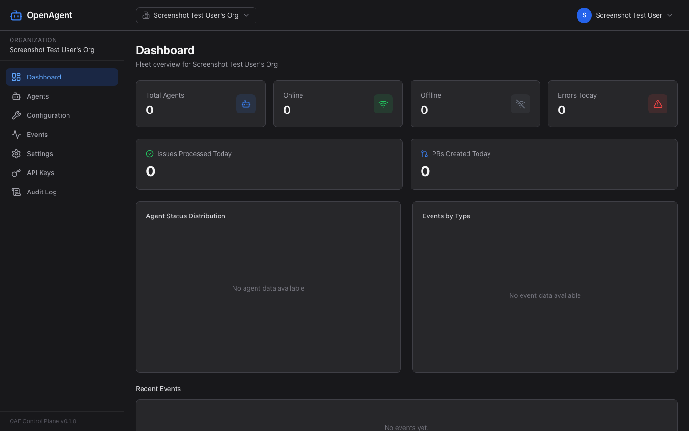
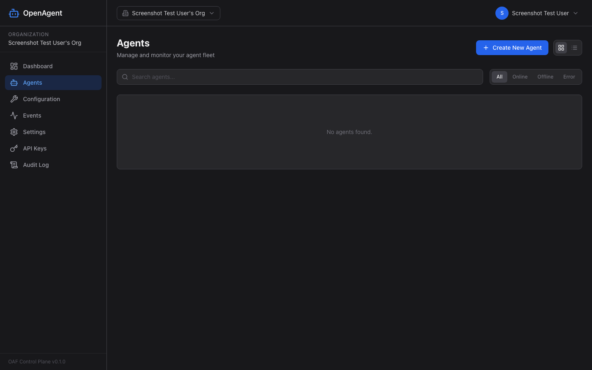
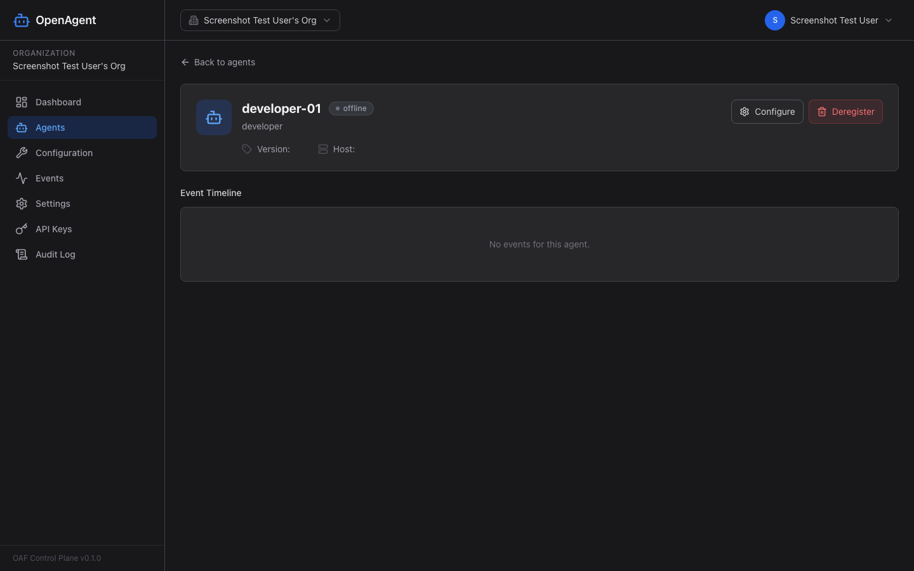
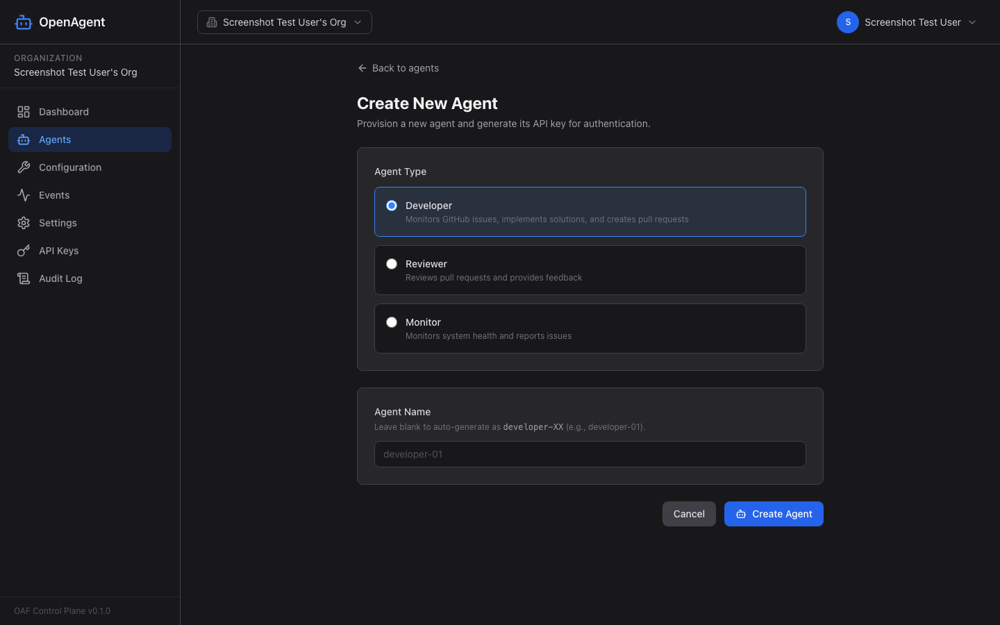
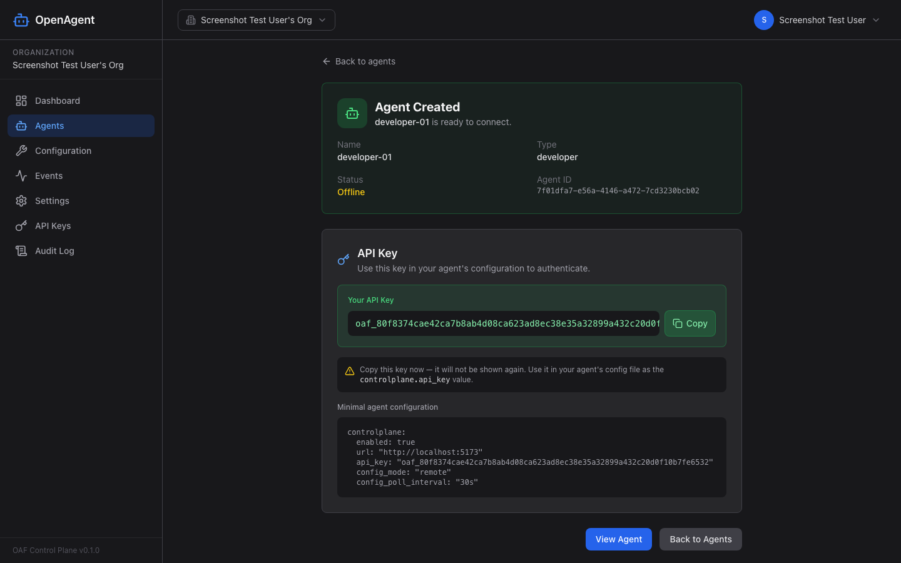
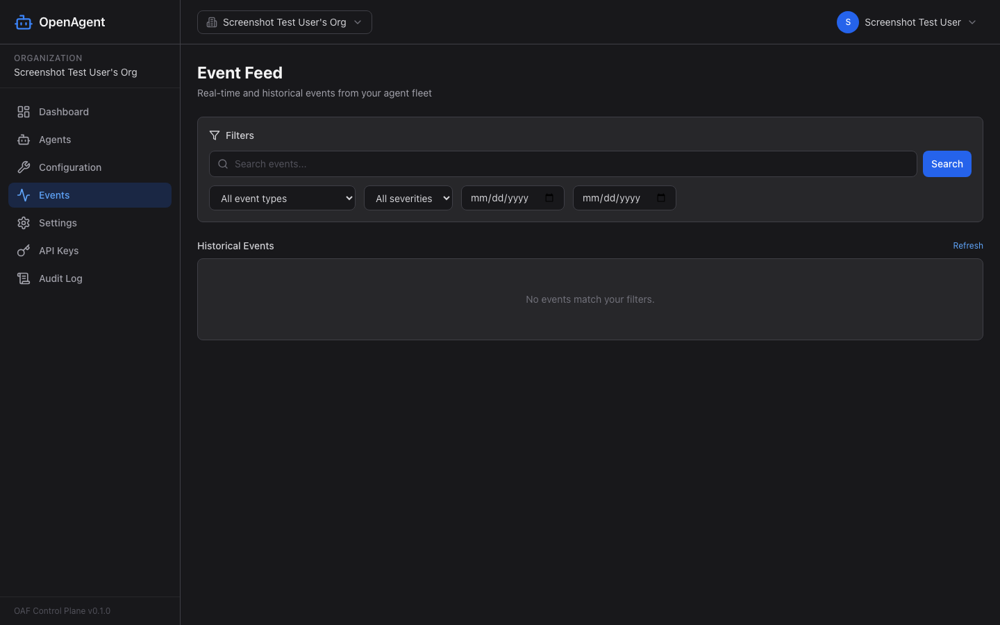
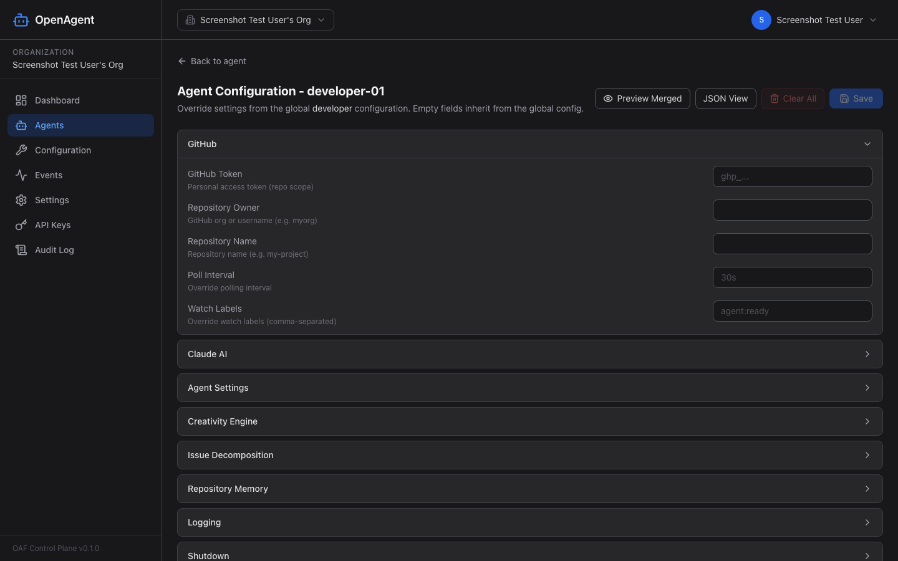
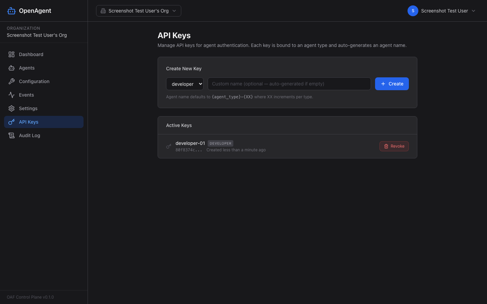
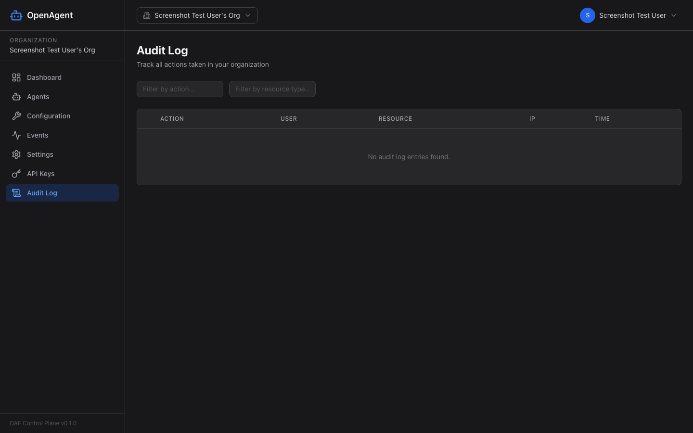

<div align="center">

# OpenAgentFramework

**Autonomous AI agents that monitor GitHub issues, write code, and create pull requests — managed from a centralized control plane.**


[Getting Started](#getting-started) · [Control Plane](#control-plane) · [Architecture](#architecture) · [Documentation](#documentation)

</div>

---

## What is OpenAgentFramework?

OpenAgentFramework turns your GitHub repository into a self-improving codebase. It provides **autonomous AI agent personas** — Developer, QA, and Development Manager — that continuously monitor your GitHub issues, analyze problems, write production-quality code, and submit pull requests for your review.

**The key idea:** GitHub is the coordination layer. Issues are the work queue. Labels signal state. Comments enable human-in-the-loop feedback. Claude is the AI engine that reads, reasons, and writes code. You stay in control — agents propose changes via pull requests, and nothing merges without your approval.

### Why OpenAgentFramework?

- **Zero-friction deployment** — Create an agent in the control plane UI, download the binary, paste your config, and run. Your agent starts picking up issues within minutes.
- **Run anywhere with ngrok** — Built-in ngrok tunnel support exposes your local control plane to the internet. Agents on remote machines, cloud VMs, or CI runners connect back securely — no port forwarding, firewall rules, or cloud hosting required. Just paste your authtoken in Settings and go.
- **Centralized management** — Configure, monitor, and control all your agents from a single web dashboard. No more editing YAML files on individual machines.
- **Human-in-the-loop by design** — Agents create pull requests, not direct commits. You review, comment, and merge on your terms.
- **Smart decomposition** — Complex issues are automatically broken down into manageable subtasks. The agent estimates complexity and splits work when needed.
- **Self-improving** — When idle, agents enter creative thinking mode, scanning your codebase for improvements and filing suggestion issues.
- **Production-grade observability** — Structured logging, correlation IDs, metrics, circuit breakers, and retry with exponential backoff on every external call.

---

## Control Plane

The control plane is a full-featured web application for managing your fleet of autonomous agents. Deploy it with Docker Compose and manage everything from your browser.

### Dashboard

Get a real-time overview of all your agents, their status, and recent activity across your organization.

<div align="center">

</div>

### Agent Management

Create, configure, and monitor individual agents. Each agent shows its current state, recent events, and configuration.

<div align="center">

</div>

<div align="center">

</div>

### Create & Deploy Agents

Creating a new agent is straightforward — choose a name, type, and target repository. The UI provides ready-to-run configuration and download instructions for the agent binary.

<div align="center">

</div>

<div align="center">

</div>

### Live Event Stream

Monitor agent activity in real time. See every issue claimed, file edited, PR created, and error encountered — with full structured event data.

<div align="center">

</div>

### Agent Configuration

Manage agent behavior directly from the UI — Claude model, polling intervals, creativity settings, decomposition thresholds, and more. Changes propagate to agents automatically when using remote configuration mode.

<div align="center">

</div>

### Organization & Security

Multi-tenant architecture with role-based access control, API key management, invitation system, and full audit logging.

<div align="center">

</div>

<div align="center">

</div>

> **See all pages and features:** [Control Plane Pages Reference](docs/controlplane/controlplane-pages.md)

---

## Getting Started

### Recommended: Centralized Control Plane (Production)

The recommended way to run OpenAgentFramework is with the **centralized control plane**. This gives you a web UI for managing agents, real-time monitoring, and remote configuration — no YAML editing on individual machines.

#### 1. Start the Control Plane

```bash
git clone https://github.com/gaskaj/OpenAgentFramework.git
cd OpenAgentFramework
docker compose up -d
```

This starts PostgreSQL, the control plane API server, and the React frontend. Open **http://localhost:5173** to access the UI.

#### 1b. (Optional) Enable Public Access with ngrok

Want to run agents on remote machines? Enable the built-in ngrok tunnel:

1. Sign up at [ngrok.com](https://dashboard.ngrok.com/signup) (free tier is fine)
2. Go to **Settings** in the control plane UI (`http://localhost:5173/settings`)
3. Paste your [ngrok authtoken](https://dashboard.ngrok.com/get-started/your-authtoken) and click **Save**

A public URL like `https://random-name.ngrok-free.dev` appears within seconds. Use this URL as the `controlplane.url` in agent configs on any machine — no port forwarding or cloud deployment needed.

> **Full guide:** [ngrok Tunnel Guide](docs/controlplane/ngrok-tunnel.md)

#### 2. Create Your Organization

Register an account, create an organization, and invite your team.

#### 3. Create an Agent

In the control plane UI, click **Create Agent** — choose a name, type, and target GitHub repository. The UI will provide:
- An **API key** for the agent to authenticate
- A **minimal configuration file** pre-filled with the control plane URL
- **Download instructions** for the agent binary

#### 4. Run the Agent

```bash
# Download or build the agent binary
make build

# Run with the minimal remote config
./bin/agentctl start --config configs/config.remote.yaml
```

The agent connects to the control plane, fetches its full configuration, and starts processing issues.

> **Remote config template:** See [`configs/config.remote.yaml`](configs/config.remote.yaml) for the minimal configuration needed.
>
> **Full remote config docs:** [Remote Configuration Guide](docs/configuration/remote-configuration.md)

### Alternative: Standalone Mode (Development)

For local development or simple single-agent setups, you can run without the control plane using a local YAML config file:

```bash
cp configs/config.example.yaml configs/config.yaml
# Edit with your GitHub token, Anthropic API key, and repo details

make build
./bin/agentctl start --config configs/config.yaml
```

> **Full configuration reference:** [Configuration Guide](docs/configuration/configuration.md)

---

## Architecture

OpenAgentFramework is built as a modular Go application with clear separation of concerns:

```
┌──────────────────────────────────────────────────────┐
│                   Control Plane                       │
│  ┌─────────┐  ┌──────────┐  ┌────────────────────┐  │
│  │ React UI│  │ REST API  │  │ PostgreSQL         │  │
│  │ (Vite)  │◄─┤ (Chi)    │◄─┤ (pgx, migrations)  │  │
│  └─────────┘  └──────────┘  └────────────────────┘  │
│                     ▲ WebSocket                       │
└─────────────────────┼────────────────────────────────┘
                      │ Events / Config / Heartbeat
         ┌────────────┼────────────────┐
         ▼            ▼                ▼
   ┌──────────┐ ┌──────────┐    ┌──────────┐
   │  Agent 1 │ │  Agent 2 │    │  Agent N │
   │(Developer)│ │  (QA)   │    │(Dev Mgr) │
   └────┬─────┘ └────┬─────┘    └────┬─────┘
        │             │               │
        ▼             ▼               ▼
   ┌─────────────────────────────────────┐
   │            GitHub API               │
   │  Issues · Labels · PRs · Comments   │
   └──────────────────┬──────────────────┘
                      │
                      ▼
              ┌───────────────┐
              │  Claude API   │
              │  (Anthropic)  │
              └───────────────┘
```

### Repository Layout

```
cmd/
  agentctl/                   Agent CLI entry point
  controlplane/               Control plane server entry point
internal/
  agent/                      Agent interface, BaseAgent, dependency injection
  orchestrator/               Concurrent agent execution with health checks
  developer/                  Developer agent: workflow, decomposition, prompts
  claude/                     Claude API client, conversation manager, tool definitions
  ghub/                       GitHub client: issues, PRs, branches, poller
  gitops/                     Git operations (clone, checkout, commit, push)
  config/                     Configuration loading (Viper), validation, defaults
  state/                      Workflow state machine, file-based persistence
  creativity/                 Idle-mode autonomous suggestion engine
  memory/                     Persistent per-repo memory for Claude efficiency
  errors/                     Retry with backoff, circuit breakers, error classification
  observability/              Structured logging, correlation IDs, metrics
  cli/                        Cobra CLI commands (start, status)
web/
  handler/                    HTTP handlers (auth, agents, events, orgs, keys, audit)
  store/                      PostgreSQL stores (pgx) for all entities
  auth/                       JWT, bcrypt, OAuth (Google, Azure)
  middleware/                 Auth, API key, logging, API versioning
  router/                     Chi router with full route tree
  ws/                         WebSocket hub for real-time streaming
  migrate/                    Embedded SQL migrations
pkg/
  apitypes/                   Shared event types between agents and control plane
  reporter/                   Buffered HTTP reporter client for agent → control plane
frontend/                     React + TypeScript + Vite control plane UI
configs/                      Configuration templates and examples
docs/                         Comprehensive documentation
```

### Developer Agent Workflow

The developer agent follows a structured state machine:

```
idle → claim → workspace → analyze → [decompose] → implement → commit → PR → validation → review → complete
```

1. **Poll** for issues labeled `agent:ready`
2. **Claim** the issue (label: `agent:claimed`, assign self)
3. **Clone** the repository into an isolated workspace
4. **Analyze** the issue with Claude — produce an implementation plan
5. **Decompose** complex issues into subtask issues (when estimated effort exceeds threshold)
6. **Implement** the solution — Claude uses tools to read, edit, search, and write files
7. **Commit & Push** changes to a feature branch
8. **Create a PR** linking back to the issue
9. **Validate** the changes and await human review

When no issues are available and creativity mode is enabled, the agent enters **creative thinking** — scanning the codebase for improvements and filing suggestion issues for your review.

> **Deep dive:** [Developer Workflow Guide](docs/guides/developer-workflow.md)

### Label Protocol

Agents coordinate entirely through GitHub labels — no external message bus required:

| Label | Meaning |
|-------|---------|
| `agent:ready` | Issue available for an agent to claim |
| `agent:claimed` | Agent has taken ownership |
| `agent:in-progress` | Implementation underway |
| `agent:in-review` | PR created, awaiting human review |
| `agent:failed` | Processing failed (see comments for details) |
| `agent:suggestion` | Creativity engine suggestion |
| `agent:subtask` | Child issue from decomposition |
| `agent:epic` | Parent issue that was decomposed |

### Claude Tool Definitions

The developer agent provides Claude with 6 tools for interacting with the codebase:

| Tool | Purpose |
|------|---------|
| `read_file` | Read file contents from the workspace |
| `edit_file` | Search-and-replace editing (old_string must be unique) |
| `write_file` | Create or overwrite a file |
| `search_files` | Regex search across the workspace (up to 50 results) |
| `list_files` | List directory contents |
| `run_command` | Execute shell commands in the workspace |

> **Full tool reference:** [Claude Integration Guide](docs/guides/claude-integration.md)

---

## Key Design Decisions

### GitHub as the Coordination Layer

Rather than building a custom task queue or message broker, OpenAgentFramework uses GitHub itself as the source of truth. Issues are tasks. Labels are state. PRs are deliverables. This means:
- **Full transparency** — every action is visible in your GitHub timeline
- **No vendor lock-in** — your work items and history live in GitHub, not a proprietary system
- **Natural collaboration** — humans and agents use the same interface

### Human-in-the-Loop by Default

Agents never push directly to protected branches. Every change goes through a pull request, giving you full control over what gets merged. You can comment on PRs to provide feedback, and agents will see your comments on subsequent runs.

### Error Resilience

Every external API call (GitHub, Claude, control plane) is wrapped with:
- **Exponential backoff retry** with jitter
- **Circuit breakers** that trip after consecutive failures
- **Error classification** to distinguish transient vs permanent failures
- **Graceful degradation** — agents continue operating even if the control plane is temporarily unreachable

> **Details:** [Error Recovery Guide](docs/observability/error-recovery.md)

### Repository Memory

Agents learn from your codebase over time. After each successful implementation, Claude extracts architectural patterns, conventions, and gotchas into a persistent per-repository memory store. This context is injected into future conversations, making the agent increasingly effective.

> **Details:** [Repository Memory Guide](docs/guides/repository-memory.md)

---

## Documentation

### Architecture & Design

| Document | Description |
|----------|-------------|
| [CLAUDE.md](CLAUDE.md) | LLM-first project orientation |
| [Architecture Overview](docs/architecture/architecture.md) | System design, packages, data flow, agent personas |
| [Package Reference](docs/architecture/package-reference.md) | Per-package API catalog with all public types |

### Guides

| Document | Description |
|----------|-------------|
| [Developer Workflow](docs/guides/developer-workflow.md) | State machine, decomposition, creativity engine |
| [Claude Integration](docs/guides/claude-integration.md) | Claude client, conversation loop, tools, prompts |
| [GitHub Integration](docs/guides/github-integration.md) | GitHub client, poller, labels, branches, PRs |
| [Code Conventions](docs/guides/code-conventions.md) | Go patterns, error handling, testing, naming |
| [Repository Memory](docs/guides/repository-memory.md) | Persistent per-repo memory for Claude efficiency |

### Configuration

| Document | Description |
|----------|-------------|
| [Configuration Guide](docs/configuration/configuration.md) | Full YAML reference, env vars, defaults |
| [Remote Configuration](docs/configuration/remote-configuration.md) | Centralized config via control plane |
| [Configuration Management](docs/configuration/configuration-management.md) | Runtime validation, environment overlays |
| [Environment Variables](docs/configuration/environment-variables.md) | Environment variable reference |

### Control Plane

| Document | Description |
|----------|-------------|
| [Control Plane Pages](docs/controlplane/controlplane-pages.md) | All UI pages with screenshots and features |
| [Control Plane Architecture](docs/controlplane/controlplane-architecture.md) | Multi-tenant design, WebSocket, auth |
| [API Reference](docs/controlplane/controlplane-api-reference.md) | REST API endpoints for the control plane |
| [Deployment Guide](docs/controlplane/controlplane-deployment.md) | Docker Compose deployment and configuration |
| [ngrok Tunnel Guide](docs/controlplane/ngrok-tunnel.md) | Expose your control plane to the internet with ngrok |
| [API Versioning](docs/controlplane/api-versioning.md) | API versioning strategy and deprecation |

### Observability & Testing

| Document | Description |
|----------|-------------|
| [Structured Logging](docs/observability/structured-logging.md) | Observability, correlation IDs, metrics |
| [Error Recovery](docs/observability/error-recovery.md) | Error handling, retry, circuit breakers |
| [Testing Strategy](docs/testing/testing-strategy.md) | Test strategy and patterns |
| [Integration Testing](docs/testing/integration-testing.md) | Integration test suite, CI pipeline |
| [Test Coverage](docs/testing/test-coverage.md) | Coverage reporting and quality gates |

---

## Development

### Prerequisites

- Go 1.22+
- Node.js 18+ (for frontend)
- Docker & Docker Compose (for control plane)
- GitHub personal access token (repo scope)
- Anthropic API key

### Build Commands

```bash
make build                    # Build agent CLI → bin/agentctl
make build-controlplane       # Build control plane server → bin/controlplane
make test                     # Run Go tests with -race
make lint                     # golangci-lint + go vet
make fmt                      # Format Go code
docker compose up             # Start full stack (PostgreSQL + API + Frontend)
```

### Frontend Development

```bash
cd frontend
npm install
npm run dev                   # Start Vite dev server
npm test                      # Run Vitest unit tests
npm run test:e2e              # Run Playwright e2e tests
```

---

## License

MIT — see [LICENSE](LICENSE) for details.
