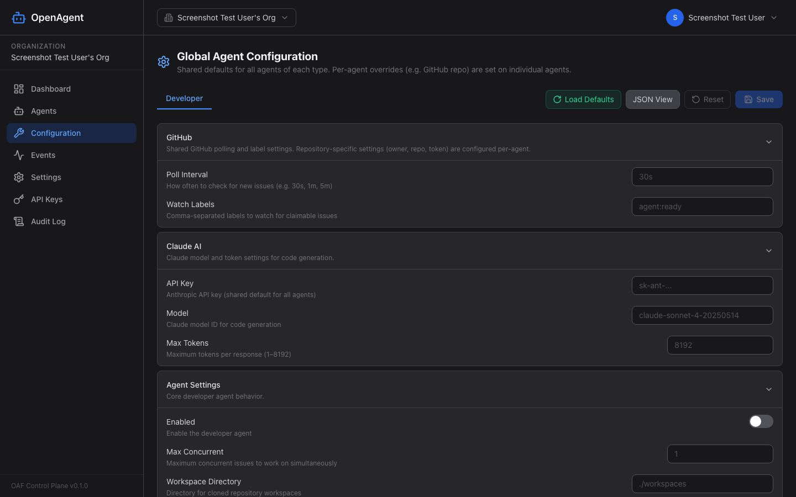
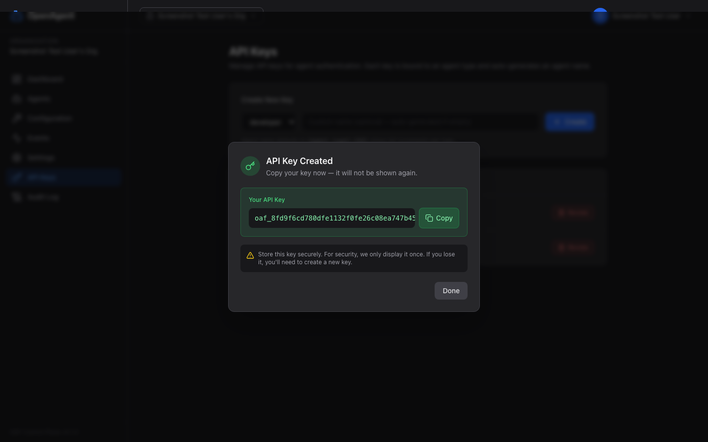
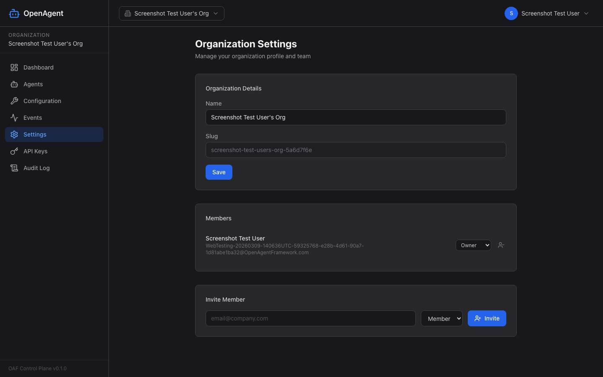

# Control Plane Pages Reference

This document describes all pages in the OpenAgentFramework control plane, their features, and how to use them. Screenshots are captured automatically via Playwright (see `frontend/e2e/screenshots.spec.ts`).

## Public Pages (No Authentication Required)

### Login Page (`/login`)


The entry point for existing users. Features:
- **Email and password** authentication form
- **Link to register** for new users
- Auto-redirects to Dashboard if already authenticated
- Dark-themed centered card with OpenAgent branding

**Source**: `frontend/src/pages/LoginPage.tsx`

---

### Register Page (`/register`)


New user account creation with validation:
- **Display name** (2+ characters)
- **Email** address
- **Password** (8+ characters) with confirmation
- Real-time form validation (React Hook Form + Zod)
- Error display for failed registration
- On success, creates a new organization and redirects to Dashboard

**Source**: `frontend/src/pages/RegisterPage.tsx`

---

### Invite Accept Page (`/invite/:token`)

Accept organization invitations via email link. States:
- **Loading** — Validating invitation token
- **Success** — Joined organization, navigate to dashboard
- **Error** — Invalid or expired token
- **Login required** — Redirects to login if not authenticated

**Source**: `frontend/src/pages/InviteAcceptPage.tsx`

---

## Authenticated Pages (Require Login)

All authenticated pages are wrapped in the `AppShell` layout with a persistent sidebar navigation.

### Dashboard (`/dashboard`)


Fleet overview with real-time statistics and visualizations:

- **Stat Cards** (top row):
  - Total Agents — count of all registered agents
  - Online — currently active agents (green)
  - Offline — disconnected agents (gray)
  - Errors Today — error events in the last 24h (red)
- **Quick Stats**: Issues Processed Today, PRs Created Today
- **Charts**:
  - Pie chart — agent status distribution (online/offline/error)
  - Bar chart — events grouped by type
- **Live Event Feed** — real-time events via WebSocket connection
- Auto-refreshes stats every 30 seconds

**Source**: `frontend/src/pages/DashboardPage.tsx`

---

### Agents List (`/agents`)


Browse and manage the agent fleet:

- **Create New Agent** button — provisions a new agent with API key (see below)
- **View toggle** — Switch between grid (cards) and table view
- **Search** — Filter agents by name, type, or GitHub repository
- **Status tabs** — All, Online, Offline, Error
- **Responsive grid** — 1 column (mobile) to 3 columns (desktop)
- Click any agent to navigate to its detail page
- Agents created via the UI appear as "offline" until the agent process connects

**Source**: `frontend/src/pages/AgentListPage.tsx`

---

### Create Agent (`/agents/new`)


Provision a new agent and generate its API key in one step:

- **Agent Type** — Select from developer, reviewer, or monitor with descriptions
- **Agent Name** — Optional; auto-generated as `{type}-{XX}` (e.g., `developer-01`) if left blank
- Creates both the agent record (status "offline") and a bound API key
- On success, shows the agent details and the raw API key:


  - Agent metadata: name, type, status, ID
  - Raw API key with copy-to-clipboard button (shown only once)
  - Ready-to-use minimal remote config YAML snippet
  - **Download & Run** section with platform-specific tabs:
    - Auto-detects the user's OS (macOS, Linux, Windows)
    - Direct download link to the versioned `agentctl` binary from the latest GitHub Release
    - Copy-paste setup script: downloads binary, writes config with pre-filled API key and control plane URL, starts the agent
    - Falls back to "build from source" instructions if no release is published yet
  - "View Agent" button to navigate to detail page

**Source**: `frontend/src/pages/CreateAgentPage.tsx`, `frontend/src/components/DownloadInstructions.tsx`

---

### Agent Detail (`/agents/:agentId`)


Detailed view of a single agent:

- **Header** — Agent name, status badge, type
- **Metadata** — Version, hostname, GitHub repo, last heartbeat, tags
- **Configuration** — JSON snapshot of the agent's config at registration time
- **Event Timeline** — Last 50 events from this agent
- **Configure** — Navigate to per-agent config override page
- **Deregister** — Remove agent (with confirmation dialog)
- Back button to return to agent list

**Source**: `frontend/src/pages/AgentDetailPage.tsx`

---

### Global Configuration (`/config`)



Manage the global (agent type-level) configuration that all agents of a given type inherit:

- **Sections**: Claude AI, Agent Settings, Creativity Engine, Issue Decomposition, Repository Memory, Logging, Shutdown, Error Handling
- **Form view** — Structured fields with descriptions and defaults matching `config.example.yaml`
- **JSON view** — Raw JSON editor for advanced users
- **Load Defaults** — Populate with sensible defaults when config is empty
- GitHub owner/repo/token and Claude API key are set at the **per-agent level**, not globally (see Agent Config Override)
- Password masking for sensitive fields (tokens, API keys)
- Version tracking with audit trail

**Source**: `frontend/src/pages/ConfigPage.tsx`

---

### Agent Config Override (`/agents/:agentId/config`)


Override specific configuration fields for a single agent, inheriting all other values from the global type config:

- **All sections** including GitHub (owner, repo, token) and Claude (API key) — these are per-agent fields
- **Inherited values** shown as placeholders from the global config
- **Amber highlights** on overridden fields with "overridden" badge on sections
- **Per-field clear** — X button to remove individual overrides
- **Override counter** — Shows how many fields are overridden
- **Preview Merged** — Shows the effective final config
- **JSON view** toggle for raw editing
- **Reset** — Remove all overrides for this agent

**Source**: `frontend/src/pages/AgentConfigOverridePage.tsx`

---

### Event Feed (`/events`)


Comprehensive real-time and historical event viewer:

- **Live Events** section at top with green pulsing indicator
- **Filters**:
  - By agent (dropdown)
  - By event type
  - By severity
  - By date range
- **Pagination** — 50 events per page with Previous/Next controls
- **Refresh** button to reload
- Real-time events stream via WebSocket alongside historical data

**Source**: `frontend/src/pages/EventFeedPage.tsx`

---

### API Keys (`/settings/api-keys`)


Manage API keys used by agents to authenticate with the control plane:

- **Create Key** — Select an agent type (developer, reviewer, monitor) and optionally provide a custom name
- Agent name auto-generates as `{type}-{XX}` if left blank
- **Key Display Modal** — Shows the raw key exactly once after creation:



  - Green-highlighted key value with monospace font
  - Copy to clipboard button with visual feedback
  - Warning: key is only shown once, store it securely
  - Done button dismisses the modal

- **Active Keys List** — Each key shows:
  - Agent name and type badge
  - Key prefix (masked)
  - Creation time
  - Last used time
  - Revoke button (removes key permanently)

**Note**: For the recommended workflow, use **Create New Agent** on the Agents page instead — it creates both the agent and API key in one step.

**Source**: `frontend/src/pages/ApiKeysPage.tsx`

---

### Organization Settings (`/settings`)



Manage organization profile, public tunnel, team, and invitations:

- **Organization Details**:
  - Edit organization name
  - View slug (read-only, auto-generated)
  - Save button with success feedback
- **Public Tunnel (ngrok)**:
  - Authtoken input — paste your [ngrok authtoken](https://dashboard.ngrok.com/get-started/your-authtoken), persisted to the database
  - Save/Clear buttons for token management
  - Toggle switch to enable/disable the tunnel (appears after token is configured)
  - Live status with green pulse indicator when tunnel is active
  - Public URL display with copy-to-clipboard and open-in-browser buttons
  - Link to ngrok dashboard for new users
  - See [ngrok Tunnel Guide](ngrok-tunnel.md) for full details
- **Members List**:
  - Each member shows name and email
  - Role selector dropdown: Owner, Admin, Member, Viewer
  - Remove button with confirmation
- **Invite New Member**:
  - Email input with validation
  - Role selector (Admin, Member, Viewer)
  - Invite button sends email invitation
- **Pending Invitations**:
  - Shows email, role, status badge, expiration time
  - Cancel button to revoke invitation

**Source**: `frontend/src/pages/OrgSettingsPage.tsx`

---

### Audit Log (`/audit`)


Track all organization actions for compliance and debugging:

- **DataTable** with columns: Action, User, Resource, IP Address, Time
- **Expandable rows** — Click chevron to view full JSON details
- **Filters**:
  - By action name (text search)
  - By resource type (text search)
- **Pagination** — 25 entries per page
- **Sortable columns** — Action and Time

**Source**: `frontend/src/pages/AuditLogPage.tsx`

---

## Common UI Patterns

| Pattern | Description |
|---------|-------------|
| Dark theme | Zinc-900/800 backgrounds, zinc-100/400 text throughout |
| Status badges | Color-coded indicators (green=online, gray=offline, red=error) |
| Form validation | React Hook Form + Zod with inline error messages |
| Loading states | Spinners and skeleton placeholders |
| Confirmation | `window.confirm()` dialogs for destructive actions |
| Real-time | WebSocket integration for live events on Dashboard and Event Feed |
| Responsive | Mobile-first grids that expand on larger screens |

## Updating Screenshots

Screenshots are captured automatically by the Playwright test at `frontend/e2e/screenshots.spec.ts`. To regenerate:

```bash
cd frontend
npx playwright test e2e/screenshots.spec.ts
```

This requires the full stack to be running (`docker compose up`). Screenshots are saved to `docs/controlplane/screenshots/`.
